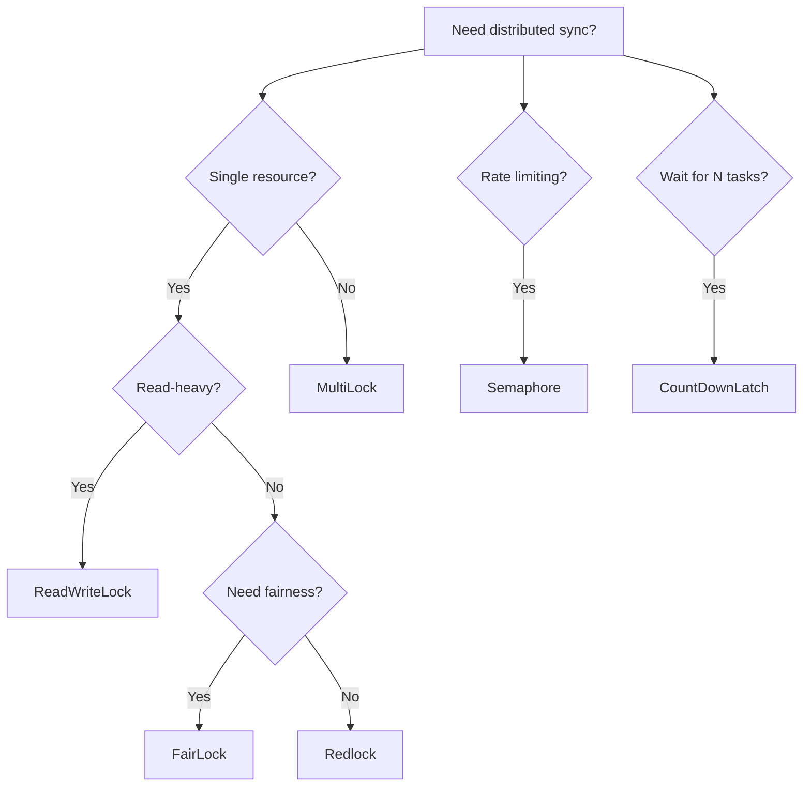

# Advanced Locking

Redlock4j provides advanced distributed synchronization primitives beyond basic locks.

## Available Primitives

| Primitive | Purpose | Details |
|-----------|---------|---------|
| [Redlock](../primitives/redlock.md) | Standard mutual exclusion | Quorum-based distributed lock |
| [FairLock](../primitives/fair-lock.md) | FIFO ordering | Prevents starvation via sorted sets |
| [MultiLock](../primitives/multi-lock.md) | Multi-resource locking | Deadlock-free atomic acquisition |
| [ReadWriteLock](../primitives/read-write-lock.md) | Reader/writer pattern | Multiple readers OR single writer |
| [Semaphore](../primitives/semaphore.md) | Permit-based limiting | Rate limiting, connection pools |
| [CountDownLatch](../primitives/count-down-latch.md) | Coordination | Wait for N operations to complete |

## Choosing the Right Primitive



| Scenario | Primitive |
|----------|-----------|
| Simple mutual exclusion | Redlock |
| Order-sensitive requests | FairLock |
| Multiple resources atomically | MultiLock |
| Many readers, few writers | ReadWriteLock |
| Limited resource pool | Semaphore |
| Coordination barrier | CountDownLatch |

### Timeout Configuration

Always use timeouts to prevent indefinite blocking:

```java
boolean acquired = lock.tryLock(5, TimeUnit.SECONDS);
if (acquired) {
    try {
        // Critical section
    } finally {
        lock.unlock();
    }
} else {
    // Handle timeout
}
```

### Error Handling

Properly handle failures:

```java
Lock lock = null;
try {
    lock = redlockManager.createLock("resource");
    lock.lock();
    // Critical section
} catch (Exception e) {
    logger.error("Error in critical section", e);
} finally {
    if (lock != null) {
        try {
            lock.unlock();
        } catch (Exception e) {
            logger.error("Error releasing lock", e);
        }
    }
}
```

## Performance Considerations

- **Fair locks** have higher overhead than regular locks
- **Multi-locks** require more Redis operations
- **Read-write locks** optimize for read-heavy scenarios
- **Semaphores** scale with permit count

## Next Steps

- [Best Practices](best-practices.md) - Follow recommended practices
- [API Reference](../api/redlock-manager.md) - Detailed API documentation

For complete details, see [ADVANCED_LOCKING.md](https://github.com/codarama/redlock4j/blob/main/ADVANCED_LOCKING.md) in the repository.

