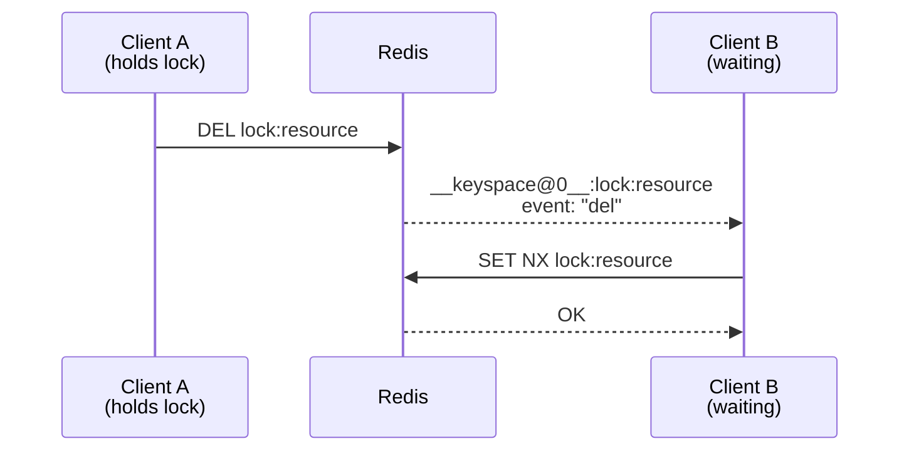
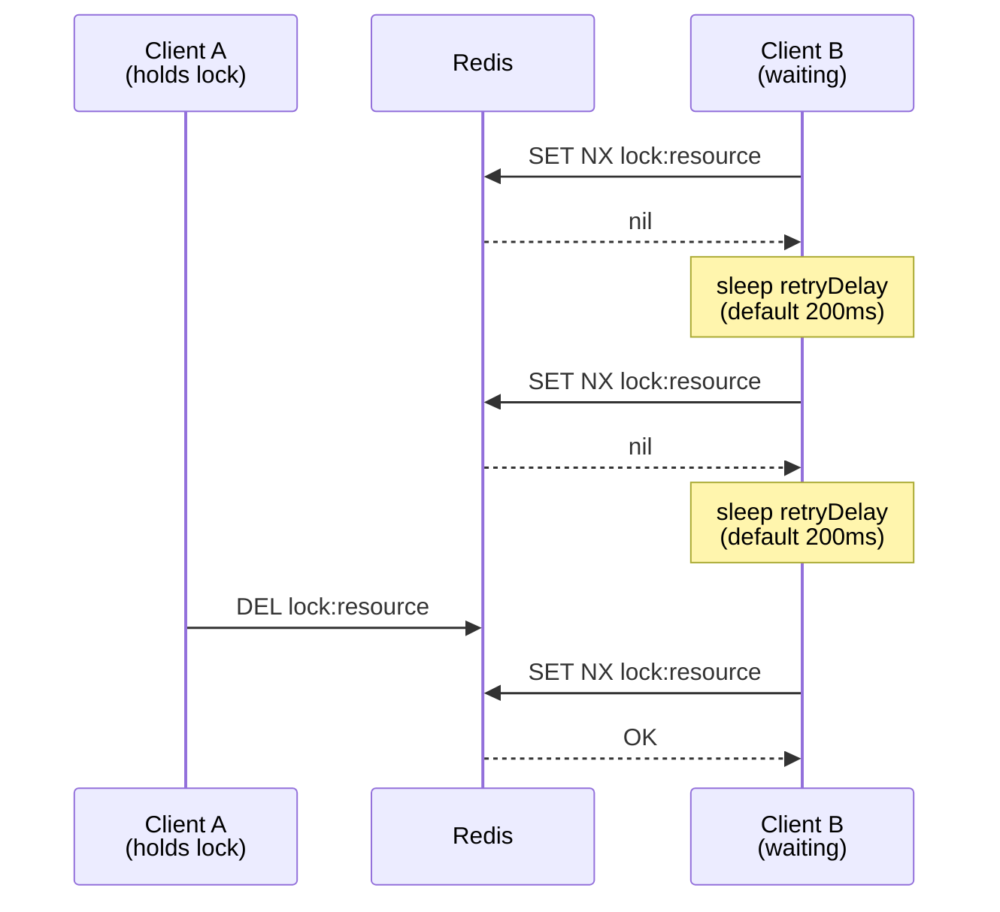
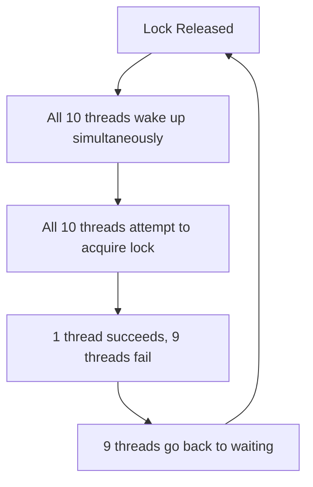
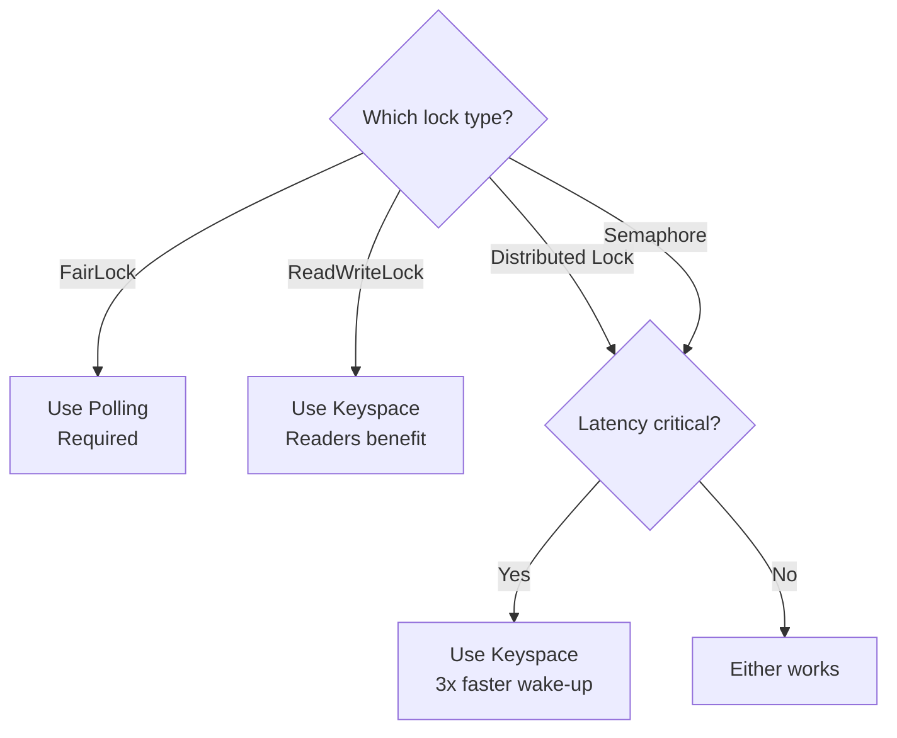
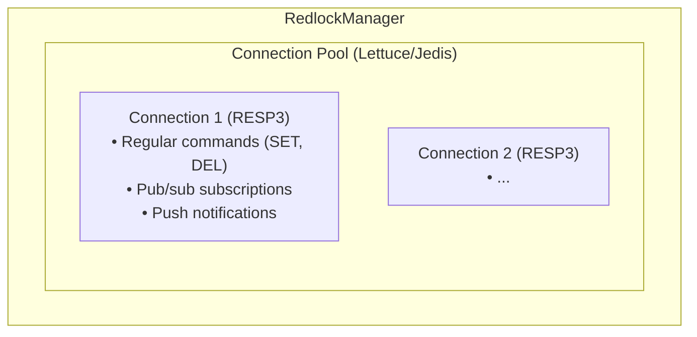
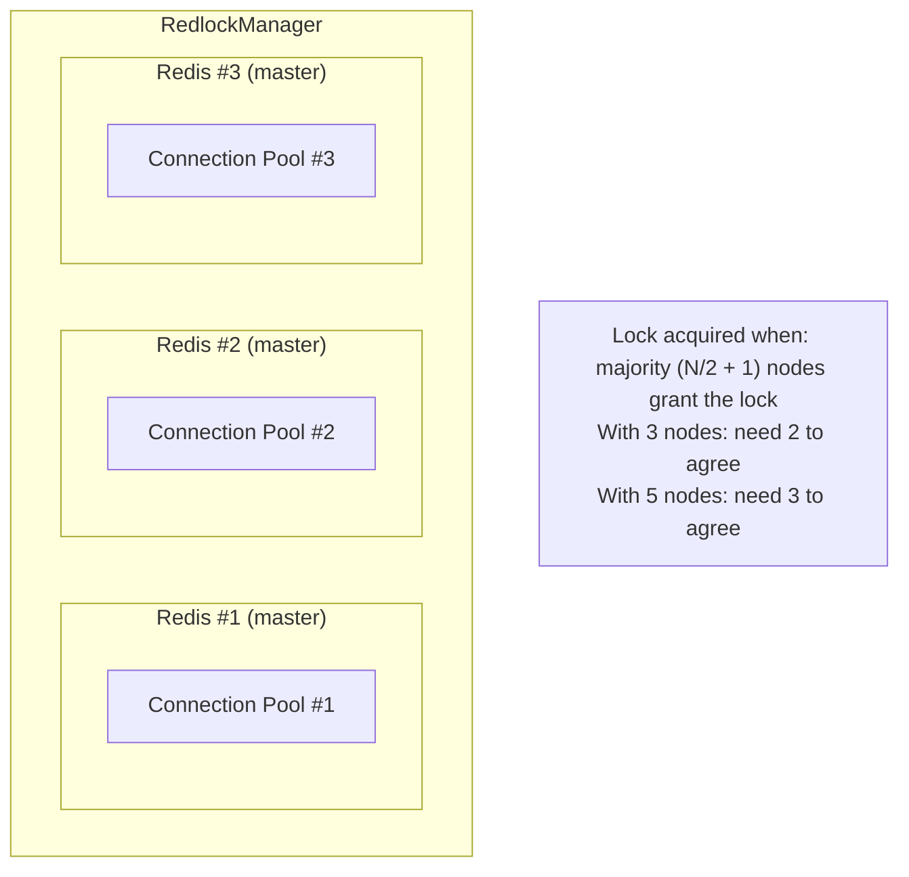
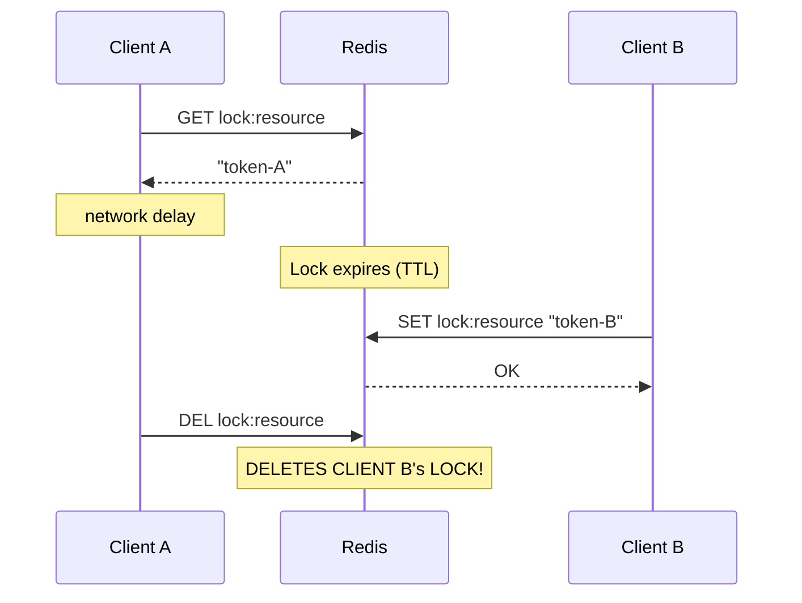
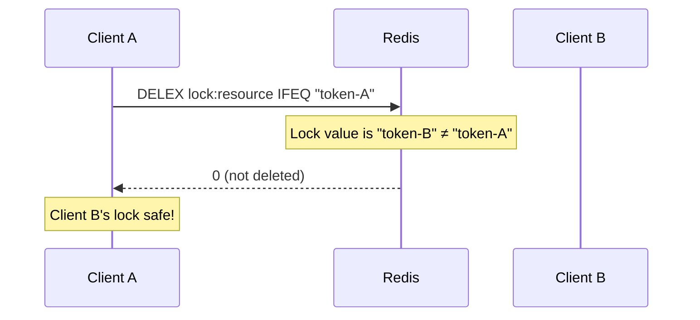

# Architecture

This document explains the key architectural decisions in redlock4j.

## Wait Strategy

When a lock is contended (another client holds it), redlock4j needs to wait for the lock to be released. The **wait strategy** determines how this waiting is implemented.

### Available Strategies

| Strategy                 | Description                                                                                       | Default |
|--------------------------|---------------------------------------------------------------------------------------------------|:-------:|
| `KEYSPACE_NOTIFICATIONS` | Uses Redis pub/sub to get instant notification when lock is released                              |   Yes   |
| `POLLING`                | Polls Redis at the configured `retryDelay` interval (default 200ms) to check if lock is available |   No    |

### Keyspace Notifications (Default)

Redis [Keyspace Notifications](https://redis.io/docs/latest/develop/use/keyspace-notifications/) allow clients to subscribe to events when keys are modified. When a lock is released (via `DEL` or expiration), Redis automatically publishes an event.



**Advantages:**

- Instant notification (1-5ms latency vs 50-100ms polling)
- Lower CPU usage (no busy-waiting)
- Efficient under high contention
- Automatic TTL expiry detection

**Requirements:**

- RESP3 protocol (required)
- Redis 6.0+ (recommended for best RESP3 support)

### Polling (Fallback)

The polling strategy checks lock availability at regular intervals. Use this only if:

- Your Redis deployment restricts `CONFIG` commands
- You're using a Redis-compatible service that doesn't support keyspace notifications
- You need to support legacy RESP2 clients (not recommended)



### Configuration

```java
// Default: Keyspace notifications (recommended)
RedlockConfiguration config = RedlockConfiguration.builder()
    .addRedisNode("localhost", 6379)
    .build();

// Explicit: Polling fallback
RedlockConfiguration config = RedlockConfiguration.builder()
    .addRedisNode("localhost", 6379)
    .waitStrategy(WaitStrategy.POLLING)
    .build();
```

### Performance Comparison

The two strategies optimize for different things:

| Metric                          | Keyspace Notifications  |          Polling           |
|---------------------------------|:-----------------------:|:--------------------------:|
| **Wake-up latency**             |          ~6ms           |  ~18-50ms (poll interval)  |
| **Throughput under contention** | Lower (thundering herd) | Higher (staggered retries) |
| **CPU usage**                   |  Lower (event-driven)   |     Higher (busy-wait)     |

**Latency benchmark** (time from lock release to waiter acquiring):

| Strategy                          | Wake-up Latency  |     Speedup     |
|-----------------------------------|:----------------:|:---------------:|
| Keyspace Notifications            |      6.78ms      | **2.7x faster** |
| Polling (50ms benchmark interval) |     18.02ms      |    baseline     |

**Throughput benchmark** (10 waiters, 20ms lock hold):

| Lock Type        |  Mode  | Keyspace (ops/s)  | Polling (ops/s)  | Notes                                         |
|------------------|:------:|:-----------------:|:----------------:|-----------------------------------------------|
| Distributed Lock | Single |       39.00       |      41.00       | ~Equal (throughput bounded by lock hold time) |
| ReadWriteLock    | Single |      151.80       |      137.10      | Keyspace 10% better (readers benefit)         |
| Semaphore        | Single |      400.35       |      402.55      | ~Equal                                        |
| FairLock         | Single |       0.50        |      30.15       | **Polling required** (see note)               |

!!! info "Understanding the Results"
    When lock hold times are short (20ms), throughput is bounded by hold time, not wait time. Both strategies achieve similar throughput (~40 ops/s for a single lock with 20ms hold).

    The **latency benefit** of keyspace notifications becomes important when:

    - Lock hold times are longer
    - Latency sensitivity is high
    - You need instant lock expiry detection

!!! warning "FairLock Recommendation"
    FairLock should always use polling. Keyspace notifications cause severe performance degradation due to queue management interactions.

### Thundering Herd Tradeoff

When using keyspace notifications, a "thundering herd" problem can occur: when a lock is released, ALL waiting threads wake up simultaneously, even though only ONE can acquire the lock.



**Why this happens:** The implementation uses a shared `CountDownLatch` per lock key. When `countDown()` is called, all waiting threads wake up at once.

**The tradeoff:**

| Aspect                       | Keyspace Notifications          | Polling                                 |
|------------------------------|---------------------------------|-----------------------------------------|
| Wakeup behavior              | All waiters wake simultaneously | Waiters check independently (staggered) |
| Wakeup overhead (10 waiters) | 10 wakeups per release          | 1 wakeup per release                    |
| Latency                      | ~1-10ms                         | Up to poll interval                     |
| CPU usage                    | Low (event-driven)              | Higher (busy-wait)                      |

This design was chosen for **simplicity**, **correctness** (no missed wakeups), and **memory efficiency** (O(keys) not O(keys × waiters)).

**When thundering herd matters:**

- **High contention** (> 20 concurrent waiters) - significant overhead
- **Short lock hold times** (< 10ms) - frequent releases cause frequent herds
- **Resource-constrained environments** - extra context switches add up

### When to Use Each Strategy

Based on comprehensive benchmarks:

| Lock Type            | Recommended Strategy   | Reason                                         |
|----------------------|------------------------|------------------------------------------------|
| **FairLock**         | **Polling (required)** | Queue management conflicts with keyspace       |
| **Distributed Lock** | Either                 | Similar throughput; keyspace has lower latency |
| **ReadWriteLock**    | Keyspace               | Readers benefit from instant wake-up           |
| **Semaphore**        | Either                 | Similar performance                            |

**Choose Keyspace Notifications (default) when:**

- Wake-up latency matters (~3x faster than polling)
- Using ReadWriteLock (readers wake up together instantly)
- Lock expiry detection must be instant
- Long lock hold times (latency benefit more noticeable)
- Low CPU usage is important (event-driven, not busy-wait)

**Choose Polling when:**

- Using FairLock (required - keyspace has severe issues)
- Redis doesn't support keyspace notifications (some managed services)
- Network reliability concerns (polling is more resilient)
- Consistent retry timing is needed

**Decision flowchart:**



**Configuration examples:**

```java
// Polling (recommended for FairLock and most use cases)
RedlockConfiguration config = RedlockConfiguration.builder()
    .addRedisNode("localhost", 6379)
    .defaultLockTimeout(Duration.ofSeconds(30))
    .retryDelay(Duration.ofMillis(10))  // Poll every 10ms
    .usePolling()                        // Better throughput for most lock types
    .build();

// Keyspace Notifications (for ReadWriteLock in single-node mode)
RedlockConfiguration config = RedlockConfiguration.builder()
    .addRedisNode("localhost", 6379)
    .defaultLockTimeout(Duration.ofSeconds(30))
    .retryDelay(Duration.ofMillis(50))  // Fallback delay
    .build();
// Keyspace notifications are enabled by default
```

---

## RESP3 Protocol Requirement

redlock4j requires RESP3 (Redis Serialization Protocol 3) for the keyspace notifications strategy. RESP3 is **not** a Redis version—it's a protocol version.

### Why RESP3?

In RESP2, subscribing to a pub/sub channel puts the connection into "subscription mode," making it unusable for regular commands. This forces applications to maintain separate connection pools for pub/sub and commands.

RESP3 introduces **push notifications**, allowing pub/sub messages to arrive on the same connection used for commands:

```java
// RESP2: Connection blocked after SUBSCRIBE
connection.subscribe(channel);    // Connection now in subscription mode
connection.get("key");            // ERROR: Cannot run commands!

// RESP3: Push notifications on same connection  
connection.subscribe(channel);    // Push messages arrive asynchronously
connection.get("key");            // WORKS: Same connection handles both!
```

### Client Library Support

| Driver  | RESP3 Support | Minimum Version |
|---------|:-------------:|:---------------:|
| Lettuce |      Yes      |      6.0+       |
| Jedis   |      Yes      |      5.0+       |

### Error Handling

If a RESP2 connection is detected, redlock4j fails fast with a clear error:

```java
// This will throw Resp2NotSupportedException
RedlockManager manager = RedlockManager.withLettuce(config);
// Exception: "RESP3 required for keyspace notifications. 
//             Connection is using RESP2 which is not supported."
```

**Solutions:**
1. Upgrade your Redis client library to a version supporting RESP3
2. Configure your client to use RESP3 protocol
3. Use `WaitStrategy.POLLING` as a fallback (not recommended)

---

## Redis Server Auto-Configuration

When using the keyspace notifications strategy (default), redlock4j automatically configures the Redis server:

```java
// redlock4j sends this on startup:
CONFIG SET notify-keyspace-events "Kgx"
```

### Configuration Flags

| Flag | Meaning           | Why We Need It                      |
|:----:|-------------------|-------------------------------------|
| `K`  | Keyspace events   | Subscribe to specific key channels  |
| `g`  | Generic commands  | Detect `DEL`, `RENAME`, `MOVE`      |
| `x`  | Expired events    | Detect TTL expiration               |

### Flag Merging

If your Redis server already has keyspace notifications configured, redlock4j merges flags rather than overwriting:

```
Existing: "Ex"     (expired keyevents)
Required: "Kgx"    (keyspace + generic + expired)
Result:   "EKgx"   (merged - preserves existing config)
```

### Permission Errors

If your Redis deployment restricts `CONFIG` commands (common in managed services), you'll see:

```
RedlockException: Cannot configure keyspace notifications.
Please run: CONFIG SET notify-keyspace-events "Kgx"
```

In this case, either:
1. Configure Redis manually via `redis.conf` or admin console
2. Use `WaitStrategy.POLLING` to avoid the `CONFIG` requirement

---

## Connection Architecture

### Single Connection per Lock Operation

redlock4j uses a single connection for both commands and pub/sub subscriptions (thanks to RESP3):



### Multi-Node Architecture (Redlock Algorithm)

For true distributed locking, redlock4j connects to multiple independent Redis nodes:



---

## CAS/CAD Operations

Distributed locks require atomic operations to safely release locks. redlock4j uses **Compare-And-Set (CAS)** and **Compare-And-Delete (CAD)** operations to ensure only the lock owner can modify or release the lock.

### The Problem

Without atomic operations, releasing a lock is unsafe:



**Result**: Client A accidentally deletes Client B's lock!

### The Solution: Atomic CAD

Compare-And-Delete ensures the lock is only deleted if the value matches:



### Implementation Strategies

redlock4j automatically detects and uses the best available method:

| Redis Version | Strategy   | Command                            |
|---------------|------------|------------------------------------|
| 8.4+          | Native     | `DELEX key IFEQ value`             |
| < 8.4         | Lua Script | `EVAL "if get==expected then del"` |

```java
// Automatic detection at driver initialization
private CADStrategy detectCADStrategy() {
    try {
        // Try native DELEX command
        redis.dispatch(CommandType.DELEX, testKey, "IFEQ", "test");
        return CADStrategy.NATIVE;  // Redis 8.4+
    } catch (Exception e) {
        return CADStrategy.SCRIPT;  // Fallback to Lua
    }
}
```

### Performance Comparison

| Operation               | Native (Redis 8.4+) |   Lua Script    |
|-------------------------|:-------------------:|:---------------:|
| **Commands**            |          1          |    1 (EVAL)     |
| **Network round-trips** |          1          |        1        |
| **Server-side parsing** |    Optimized C      | Lua interpreter |
| **Latency**             |       ~0.1ms        |   ~0.2-0.3ms    |

Both approaches have identical network characteristics, but native commands have lower server-side overhead.

### CAS for Lock Extension

When extending a lock's TTL, CAS ensures only the current owner can extend:

```java
// Extend lock only if we still own it
boolean extended = driver.setIfValueMatches(
    lockKey,
    currentToken,      // Expected current value
    currentToken,      // New value (same token)
    newExpireTimeMs    // New TTL
);
```

**Redis 8.4+ command:**
```
SET lock:resource "token-A" IFEQ "token-A" PX 30000
```

**Lua script fallback:**
```lua
if redis.call('get', KEYS[1]) == ARGV[1] then
    return redis.call('set', KEYS[1], ARGV[2], 'PX', ARGV[3])
else
    return nil
end
```

### Why This Matters

| Scenario                        | Without CAS/CAD         | With CAS/CAD       |
|---------------------------------|-------------------------|--------------------|
| Lock expires during operation   | May delete wrong lock   | Safely fails       |
| Network partition during unlock | Unpredictable           | Atomic check       |
| Concurrent lock extension       | Race condition          | Only owner extends |
| Lock ownership verification     | Separate GET+DEL        | Single atomic op   |

### Configuration

CAS/CAD strategy is automatically detected—no configuration needed:

```java
// Driver auto-detects Redis version capabilities
RedlockManager manager = RedlockManager.withJedis(config);
// Native commands used if Redis 8.4+ detected
// Lua scripts used otherwise
```

To verify which strategy is active, enable debug logging:

```
DEBUG o.c.r.driver.JedisRedisDriver - Native CAS/CAD commands detected for redis://localhost:6379
```

or

```
DEBUG o.c.r.driver.JedisRedisDriver - Native CAS/CAD not available for redis://localhost:6379, using Lua scripts
```

---

## Performance Analysis

This section summarizes the optimization work driven by the `redlock4j-benchmark` suite and reports the current cross-primitive standings against Redisson and other Redis-based locking libraries.

### Methodology

All numbers below come from the same harness (`redlock4j-benchmark/`) running against a fresh 3-node Redis 7 Testcontainers cluster, 50 ms simulated work per critical section, 30 s warm-up, 60 s measurement. Lock-acquisition latency is captured per attempt; throughput is aggregated across all clients. Full raw data lives in `redlock4j-benchmark/benchmark-analysis.md` and the per-suite `*-benchmark-results.json` files.

### Key Optimizations

Two architectural changes deliver the bulk of the recent performance improvements:

**1. Parallel multi-node I/O** — `MultiNodeStrategy.acquireLock` / `releaseLock` / `extendLock` previously iterated nodes sequentially. They now fan out via `CompletableFuture` and wait for the quorum on the join. Effect: the per-attempt RTT on a 3-node cluster collapses from `3 × RTT` to `max(RTT)`.

**2. Exponential backoff with jitter** — `PollingWaitStrategy` and the `Redlock.tryLock` fallback path now grow the inter-attempt delay geometrically (configurable multiplier, cap, and jitter ratio). The previous fixed retry (50 ms in the benchmark config) produced retry storms under contention. Backoff reduces wasted RTTs and stabilizes throughput. `FairLock` is intentionally excluded because head-of-queue waiters need tight polling to claim the lock the instant the holder releases.

### p99 vs Throughput

These two metrics measure opposite ends of the same latency distribution and trade off against each other:

- **Throughput (Ops/s)** is system capacity — how many acquire+release cycles complete per second. Driven by RTTs per attempt, inter-attempt delay, and hold time.
- **p99 latency** is the worst-case experience for 99 % of callers. Driven by contention bursts, retry chains, and any single stuck attempt.

Aggressive polling raises throughput but inflates p99 (more attempts compete for the same release window). Backoff lowers p99 by reducing wasted attempts but can cap throughput when waiters sleep through release windows. Pub/sub-on-release (planned, see `benchmark-analysis.md` §8 A3) is the rare lever that improves both.

Which metric matters depends on the workload:

| Workload                                | Primary metric     |
|-----------------------------------------|--------------------|
| Leader election, failover               | **p99 / max**      |
| API request serialization (per-user)    | **p99**            |
| Cache-stampede prevention               | **p99 of waiters** |
| Batch / background jobs                 | **Throughput**     |
| Rate limiting, semaphores               | **Throughput**     |
| Critical section on a hot business path | **Both**           |

### Consolidated Results

All measurements taken on the same 3-node Redis cluster. `redlock4j-singlenode` is `redlock4j` in single-node mode (`SingleNodeStrategy`); `redlock4j` (or `redlock4j-3node`) uses full quorum Redlock across all 3 nodes.

#### Throughput (Ops/s — higher is better)

| Primitive               |   Redisson | redlock4j-singlenode | redlock4j-3node | Field leader        |
|-------------------------|-----------:|---------------------:|----------------:|---------------------|
| DistributedLock         |      18.24 |            **18.33** |            0.81 | redpulsar (21.63)   |
| FairLock                |  **16.99** |                12.42 |            2.95 | redisson            |
| MultiLock               |      17.05 |                16.97 |       **17.72** | **redlock4j-3node** |
| ReadWriteLock (reader)  | **151.65** |                74.66 |           95.41 | redisson            |
| ReadWriteLock (writer)  |       0.21 |                15.63 |       **16.42** | **redlock4j-3node** |
| Semaphore               |      54.71 |            **91.09** |           87.50 | **redlock4j**       |
| CountDownLatch          |      59.02 |                58.19 |       **59.91** | **redlock4j-3node** |

#### p50 Latency (ms — lower is better)

| Primitive               |  Redisson | redlock4j-singlenode | redlock4j-3node |
|-------------------------|----------:|---------------------:|----------------:|
| DistributedLock         |     122.9 |             **67.1** |           191.3 |
| FairLock                | **221.0** |                332.0 |          1666.0 |
| MultiLock               |     190.2 |                202.9 |       **171.0** |
| ReadWriteLock (reader)  |  **0.79** |                12.54 |            2.72 |
| ReadWriteLock (writer)  |    8649.0 |                 57.8 |        **64.1** |
| Semaphore               |      1.00 |             **0.73** |            1.77 |
| CountDownLatch          |      17.2 |                 16.2 |        **15.3** |

#### p99 Latency (ms — lower is better)

| Primitive               |  Redisson | redlock4j-singlenode | redlock4j-3node |
|-------------------------|----------:|---------------------:|----------------:|
| DistributedLock         |    1286.7 |               1977.5 |       **858.0** |
| FairLock                | **229.8** |                434.8 |          2457.1 |
| MultiLock               |    1192.2 |               1709.5 |      **1057.6** |
| ReadWriteLock (reader)  |  **5.82** |                340.6 |           348.4 |
| ReadWriteLock (writer)  |   16820.7 |                755.6 |       **104.2** |
| Semaphore               |     386.5 |             **2.21** |            4.20 |
| CountDownLatch          |      22.6 |                 19.9 |        **19.9** |

### Standings Summary

**redlock4j leads on throughput in 4 / 7 categories** (MultiLock, RWLock writer, Semaphore, CountDownLatch — plus single-node DistributedLock parity with the field), and **leads on p99 in 5 / 7** (DistributedLock 3-node, RWLock writer, MultiLock, Semaphore, CountDownLatch).

Remaining gaps under active investigation (`benchmark-analysis.md` §8):

- **DistributedLock 3-node throughput** is the largest residual gap. The 50 ms polling floor is the bottleneck; A3 (pub/sub-on-release wait strategy) targets this directly.
- **FairLock 3-node throughput** suffers from the per-attempt quorum head-check round-trip. P2-8 (single-shot atomic head-check + acquire) is the structural fix.
- **RWLock readers** trail Redisson because Redisson decrements readers in-process via semaphore counting while redlock4j hits Redis on every read acquire. This is an architectural choice, not a regression.

### What This Means for Users

- Pick `redlock4j-singlenode` when you have a single Redis instance — you get parity with single-node libraries on most primitives and a clear win on Semaphore.
- Pick `redlock4j-3node` (full Redlock quorum) when you need fault tolerance across independent Redis masters. Expect lower throughput on the basic `DistributedLock` and `FairLock` primitives until A3 / P2-8 land; everything else (MultiLock, RWLock writers, Semaphore, CountDownLatch) is already at or above field-leader performance.
- For latency-sensitive paths, the recent backoff change generally improves p99 (best-in-class on 5 / 7 primitives). The exception is `FairLock`, where polling is required for correctness reasons (see *FairLock Recommendation* above).

---

## Summary

| Decision              | Choice                 | Rationale                                   |
|-----------------------|------------------------|---------------------------------------------|
| Default wait strategy | Keyspace Notifications | 20-50x faster under contention              |
| Protocol requirement  | RESP3                  | Single connection for commands + pub/sub    |
| Server configuration  | Auto-configure         | Zero manual setup required                  |
| Fallback option       | Polling                | For restricted environments                 |
| CAS/CAD operations    | Auto-detect            | Native commands on Redis 8.4+, Lua fallback |
| Multi-node I/O        | Parallel fan-out       | `max(RTT)` per attempt instead of `N × RTT` |
| Retry backoff         | Exponential + jitter   | Reduces retry storms under contention       |
