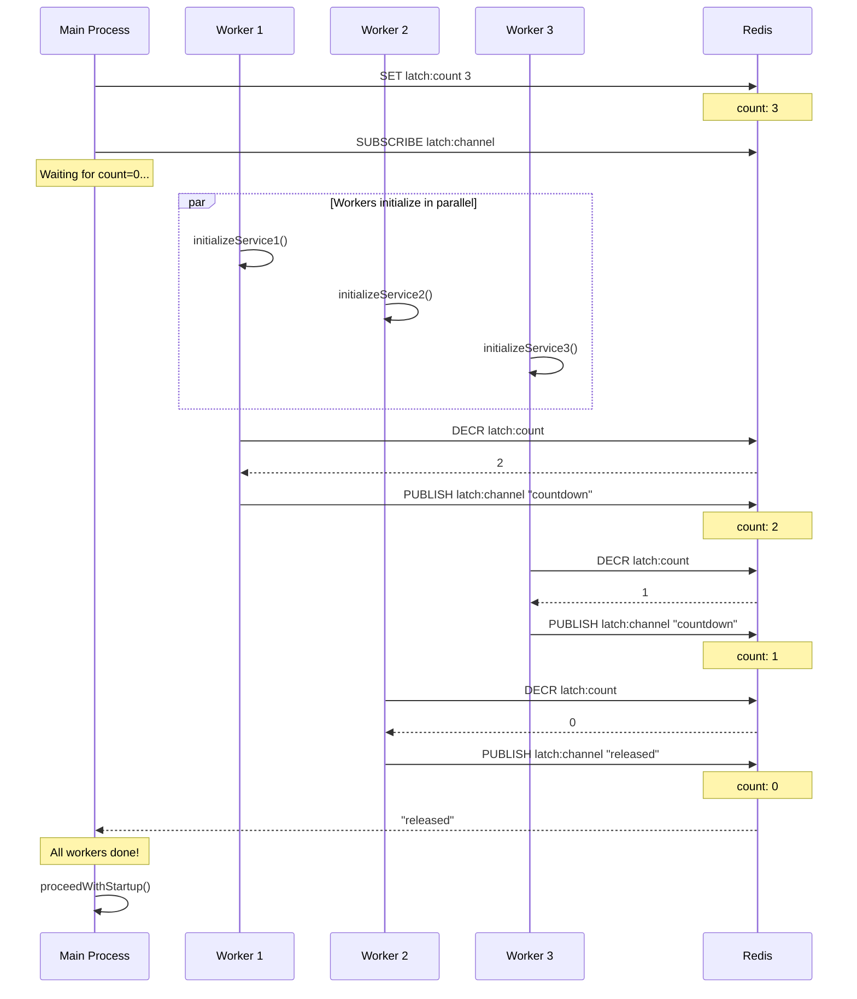

# CountDownLatch - Distributed Coordination

CountDownLatch allows threads to wait until a set of operations completes across distributed processes.

## Overview

| Property | Value |
|----------|-------|
| **Type** | Coordination Barrier |
| **Reusable** | No (one-time use) |
| **Count Direction** | Decrement only |
| **Notification** | Pub/Sub or polling |

## How It Works



## Key Concepts

### Atomic Count Decrement
```lua
local count = redis.call("DECR", latch_key)
if count <= 0 then
    redis.call("PUBLISH", channel_key, "released")
end
return count
```

### Quorum-Based Count
In multi-node setup, count is maintained on majority of nodes:
```
Final count = median of all node counts
```

### Wait Mechanism
Two strategies for waiting:
1. **Pub/Sub** (default): Instant notification via Redis channels
2. **Polling**: Periodic count checks (for restricted environments)

!!! note "Mode Differences"
    The diagram above shows the conceptual flow. In **multi-node mode**:

    - Count is maintained independently on each node
    - `countDown()` decrements on all nodes
    - `getCount()` returns the **median** value across nodes
    - Latch releases when quorum of nodes reach zero

## Usage

```java
// Create latch waiting for 3 operations
RedlockCountDownLatch latch = redlockManager.createCountDownLatch("startup", 3);

// Worker threads count down
new Thread(() -> {
    initializeService1();
    latch.countDown();
}).start();

new Thread(() -> {
    initializeService2();
    latch.countDown();
}).start();

new Thread(() -> {
    initializeService3();
    latch.countDown();
}).start();

// Main thread waits
latch.await();  // Blocks until count reaches 0
System.out.println("All services ready!");

// Or wait with timeout
if (latch.await(Duration.ofSeconds(30))) {
    System.out.println("All services ready!");
} else {
    System.out.println("Timeout waiting for services");
}
```

## Use Cases

| Scenario             | Initial Count | Purpose                    |
|----------------------|---------------|----------------------------|
| Service startup      | N services    | Wait for all to initialize |
| Batch processing     | N jobs        | Wait for all to complete   |
| Test coordination    | N threads     | Synchronize test execution |
| Distributed workflow | N stages      | Gate between stages        |

## Methods

| Method            | Description                   |
|-------------------|-------------------------------|
| `countDown()`     | Decrement count by 1          |
| `await()`         | Wait indefinitely for count=0 |
| `await(Duration)` | Wait with timeout             |
| `getCount()`      | Current count value           |

## Supported Modes

| Mode                    | Supported  | Notes                                |
|-------------------------|------------|--------------------------------------|
| **Single Node**         | Yes        | Count on single instance             |
| **Multi-Node (Quorum)** | Yes        | Count averaged (median) across nodes |

In multi-node mode, `getCount()` returns the median value across all nodes for consistency.

## Configuration

| Parameter                  | Default    | Description            |
|----------------------------|------------|------------------------|
| `initialCount`             | (required) | Starting count value   |
| `latchTimeoutMs`           | 300000     | Latch expiration TTL   |
| `useKeyspaceNotifications` | true       | Use Pub/Sub vs polling |

## Comparison with Java CountDownLatch

| Feature           | Java CDL      | Redlock CDL       |
|-------------------|---------------|-------------------|
| Scope             | Single JVM    | Distributed       |
| Persistence       | Memory        | Redis             |
| Failure recovery  | Lost on crash | Survives restarts |
| Network partition | N/A           | Quorum-based      |

## When to Use

**Good for:**
- Distributed service startup coordination
- Batch job completion waiting
- Multi-stage workflow gates
- Cross-service synchronization

**Not for:**
- Repeated coordination → use barriers or semaphores
- Mutual exclusion → [Redlock](redlock.md)

## See Also

- [Semaphore](semaphore.md) - Permit-based limiting
- [Redlock](redlock.md) - Mutual exclusion
