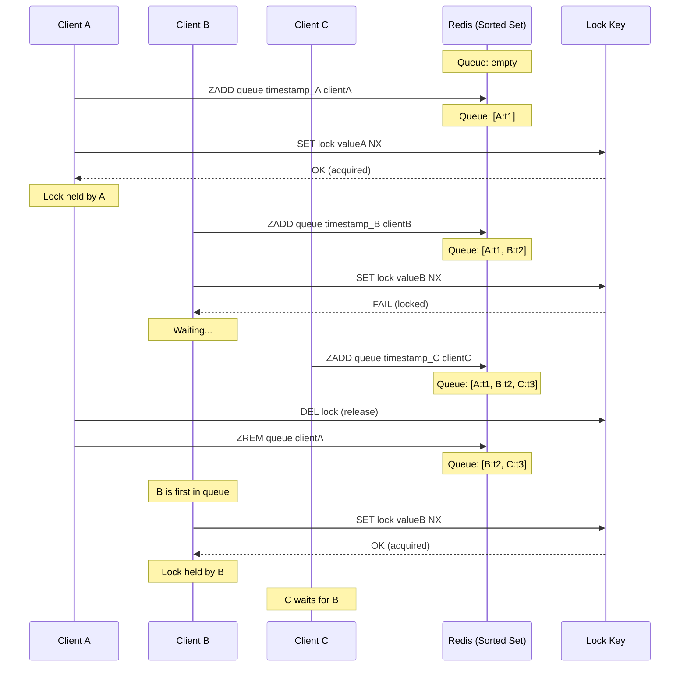

# FairLock - FIFO Distributed Lock

Fair locks ensure threads acquire locks in the order they requested them (First-In-First-Out ordering).

## Overview

| Property | Value |
|----------|-------|
| **Type** | Exclusive Lock with FIFO ordering |
| **Reentrancy** | Supported (per-thread) |
| **Interface** | `java.util.concurrent.locks.Lock` |
| **Data Structure** | Redis Sorted Set (queue) |

## How It Works



## Key Concepts

### Sorted Set Queue
Waiters register with timestamps as scores:
```
ZADD "mylock:queue" 1234567890 "client-uuid"
```
Lowest score = first in queue.

### Queue Position Check
Before acquiring, check if you're at the front:
```lua
local first = redis.call("ZRANGE", queue_key, 0, 0)
if first[1] == client_token then
    -- Attempt lock acquisition
end
```

### Automatic Cleanup
Expired waiters are periodically removed:
```
ZREMRANGEBYSCORE queue 0 (current_time - timeout)
```

!!! note "Mode Differences"
    The diagram above shows the conceptual flow. In **multi-node mode**:

    - Queue operations (ZADD, ZRANGE) are performed on all nodes
    - Lock acquisition requires quorum (N/2+1 nodes)
    - Clock drift is subtracted from validity time
    - If quorum fails, acquired locks are rolled back

## Usage

```java
Lock fairLock = redlockManager.createFairLock("fair-resource");

fairLock.lock();
try {
    // FIFO order guaranteed
    performWork();
} finally {
    fairLock.unlock();
}
```

## Trade-offs

| Aspect | FairLock | Standard Redlock |
|--------|----------|------------------|
| **Ordering** | Guaranteed FIFO | Non-deterministic |
| **Throughput** | Lower | Higher |
| **Redis Operations** | More (queue mgmt) | Fewer |
| **Starvation** | Prevented | Possible |

## Supported Modes

| Mode | Supported | Notes |
|------|-----------|-------|
| **Single Node** | ✅ | Queue maintained on single instance |
| **Multi-Node (Quorum)** | ✅ | Queue replicated, quorum for lock acquisition |

## Configuration

| Parameter | Default | Description |
|-----------|---------|-------------|
| `lockTimeoutMs` | 30000 | Lock TTL in Redis |
| `queueTimeoutMs` | 60000 | Queue entry TTL |
| `cleanupIntervalMs` | 5000 | Stale entry cleanup interval |

## When to Use

**Good for:**
- Preventing starvation
- Order-sensitive operations
- Ticket/booking systems
- Sequential job processing

**Consider alternatives for:**
- High-throughput scenarios → [Redlock](redlock.md)
- Read-heavy workloads → [ReadWriteLock](read-write-lock.md)

## See Also

- [Redlock](redlock.md) - Standard (non-fair) locking
- [MultiLock](multi-lock.md) - Atomic multi-resource locking
