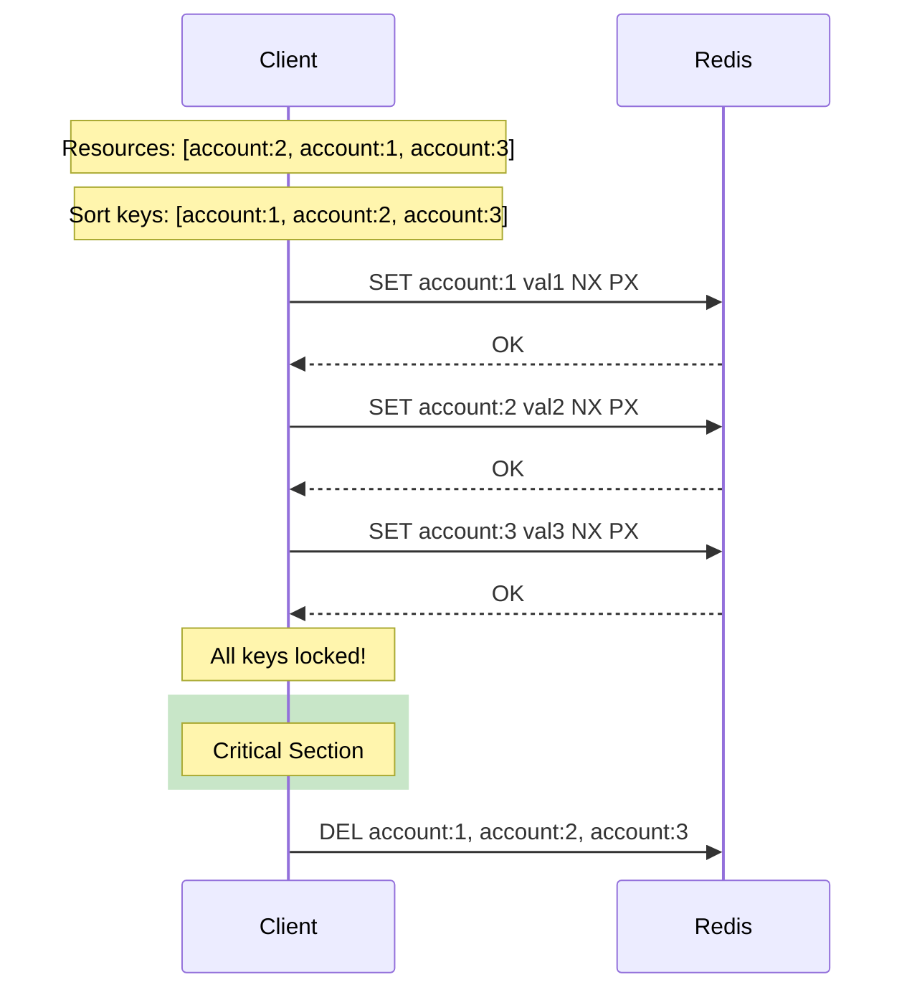
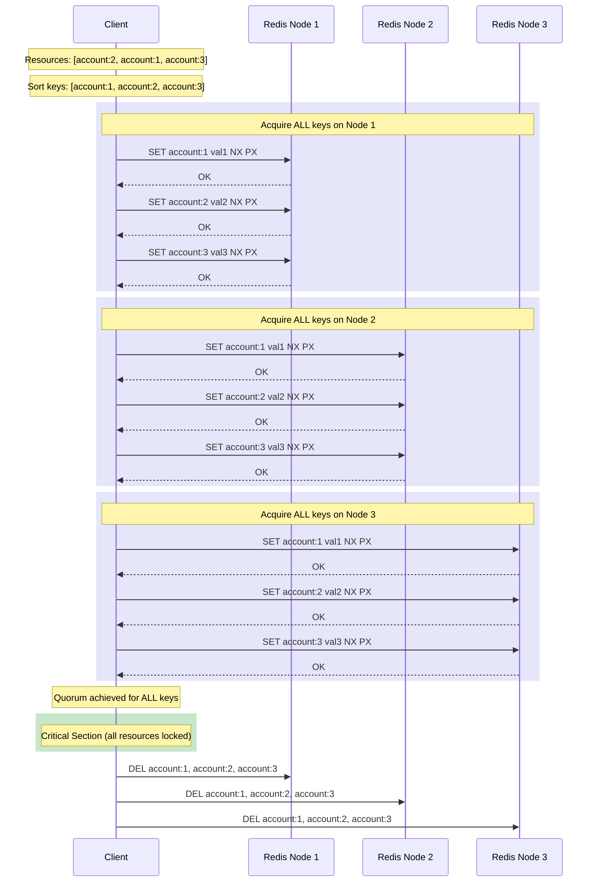

# MultiLock - Atomic Multi-Resource Locking

MultiLock enables atomic acquisition of multiple resources, preventing deadlocks through consistent ordering.

## Overview

| Property | Value |
|----------|-------|
| **Type** | Exclusive Lock (multiple keys) |
| **Reentrancy** | Supported (per-thread) |
| **Interface** | `java.util.concurrent.locks.Lock` |
| **Deadlock Prevention** | Sorted key ordering |

## How It Works

### Single Node Mode



### Multi-Node Mode (Quorum)



## Key Concepts

### Sorted Key Ordering
Keys are sorted to prevent deadlocks:
```java
// Input: ["account:2", "account:1", "account:3"]
// Locked: ["account:1", "account:2", "account:3"]
```
All clients acquire in the same order → no circular wait.

### All-or-Nothing Semantics
If any key fails to acquire quorum, all acquired keys are released:
```
Success: All keys locked → proceed
Failure: Any key fails → release all, retry
```

### Unique Lock Values
Each key gets a unique lock value for safe unlock:
```java
Map<String, String> lockValues = {
    "account:1" → "uuid-1",
    "account:2" → "uuid-2", 
    "account:3" → "uuid-3"
}
```

## Usage

```java
Lock multiLock = redlockManager.createMultiLock(
    Arrays.asList("account:1", "account:2", "account:3")
);

multiLock.lock();
try {
    // All three accounts are now locked atomically
    transferBetweenAccounts();
} finally {
    multiLock.unlock();
}
```

## Deadlock Prevention

Without consistent ordering, deadlocks can occur:

| Time | Client A | Client B |
|------|----------|----------|
| T1 | Lock account:1 ✓ | Lock account:2 ✓ |
| T2 | Wait account:2 | Wait account:1 |
| T3 | **DEADLOCK** | **DEADLOCK** |

With sorted ordering, both clients lock `account:1` first → no deadlock.

## Supported Modes

| Mode | Supported | Notes |
|------|-----------|-------|
| **Single Node** | ✅ | All keys locked on single instance |
| **Multi-Node (Quorum)** | ✅ | All keys must achieve quorum on each node |

In multi-node mode, ALL keys must be successfully locked on a quorum of nodes for the MultiLock to succeed.

## Configuration

| Parameter | Default | Description |
|-----------|---------|-------------|
| `lockTimeoutMs` | 30000 | Lock TTL per key |
| `acquisitionTimeoutMs` | 10000 | Max total wait time |

## When to Use

**Good for:**
- Banking: transferring between accounts
- Inventory: reserving multiple items atomically
- Graph operations: locking connected nodes

**Consider alternatives for:**
- Single resource → [Redlock](redlock.md)
- Permit-based limiting → [Semaphore](semaphore.md)

## See Also

- [Redlock](redlock.md) - Single resource locking
- [ReadWriteLock](read-write-lock.md) - Reader/writer pattern
