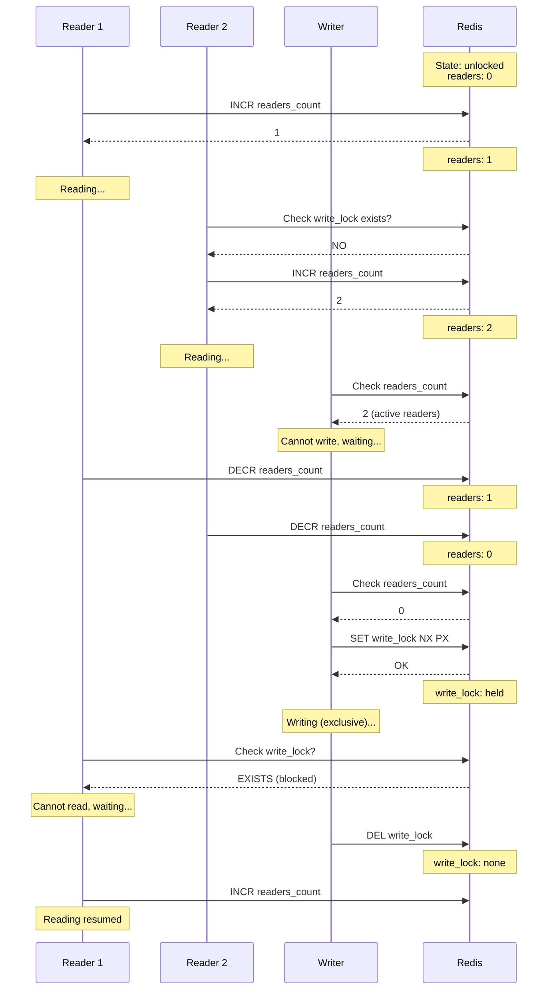

# ReadWriteLock - Distributed Reader/Writer Lock

ReadWriteLock allows multiple concurrent readers OR a single exclusive writer.

## Overview

| Property      | Value                                      |
|---------------|--------------------------------------------|
| **Type**      | Shared/Exclusive Lock                      |
| **Readers**   | Multiple concurrent                        |
| **Writers**   | Single exclusive                           |
| **Interface** | `java.util.concurrent.locks.ReadWriteLock` |

## How It Works



## Key Concepts

### Reader Count Tracking
Readers increment/decrement a distributed counter:
```
INCR resource:readers    # Acquire read lock
DECR resource:readers    # Release read lock
```

### Write Lock Exclusion
Writers must wait for `readers == 0` AND acquire exclusive lock:
```lua
local readers = redis.call("GET", "resource:readers")
if (readers == nil or tonumber(readers) == 0) then
    return redis.call("SET", "resource:write", value, "NX", "PX", timeout)
end
return nil
```

### Preventing Writer Starvation
When a writer is waiting, new readers may be blocked to prevent indefinite starvation.

!!! note "Mode Differences"
    The diagram above shows the conceptual flow. In **multi-node mode**:

    - Reader count is maintained on all nodes independently
    - Write lock requires quorum (N/2+1 nodes)
    - Reader count check uses aggregated value across nodes
    - Clock drift is applied to lock validity time

## Usage

```java
RedlockReadWriteLock rwLock = redlockManager.createReadWriteLock("resource");

// Multiple readers can read simultaneously
rwLock.readLock().lock();
try {
    readData();
} finally {
    rwLock.readLock().unlock();
}

// Writer has exclusive access
rwLock.writeLock().lock();
try {
    writeData();
} finally {
    rwLock.writeLock().unlock();
}
```

## Concurrency Matrix

| Holder    | Read Request  | Write Request  |
|-----------|---------------|----------------|
| None      | ✓ Granted     | ✓ Granted      |
| Reader(s) | ✓ Granted     | ✗ Blocked      |
| Writer    | ✗ Blocked     | ✗ Blocked      |

## Supported Modes

| Mode                    | Supported  | Notes                              |
|-------------------------|------------|------------------------------------|
| **Single Node**         | Yes        | Reader count on single instance    |
| **Multi-Node (Quorum)** | Yes        | Reader count averaged across nodes |

## Configuration

| Parameter         | Default  | Description        |
|-------------------|----------|--------------------|
| `lockTimeoutMs`   | 30000    | Lock TTL           |
| `readerTimeoutMs` | 30000    | Reader counter TTL |

## When to Use

**Good for:**
- Caching: multiple readers, occasional updates
- Configuration: frequent reads, rare writes
- Reports: concurrent read access

**Consider alternatives for:**
- Equal read/write frequency → [Redlock](redlock.md)
- FIFO ordering needed → [FairLock](fair-lock.md)

## See Also

- [Redlock](redlock.md) - Standard exclusive locking
- [Semaphore](semaphore.md) - Permit-based concurrency
