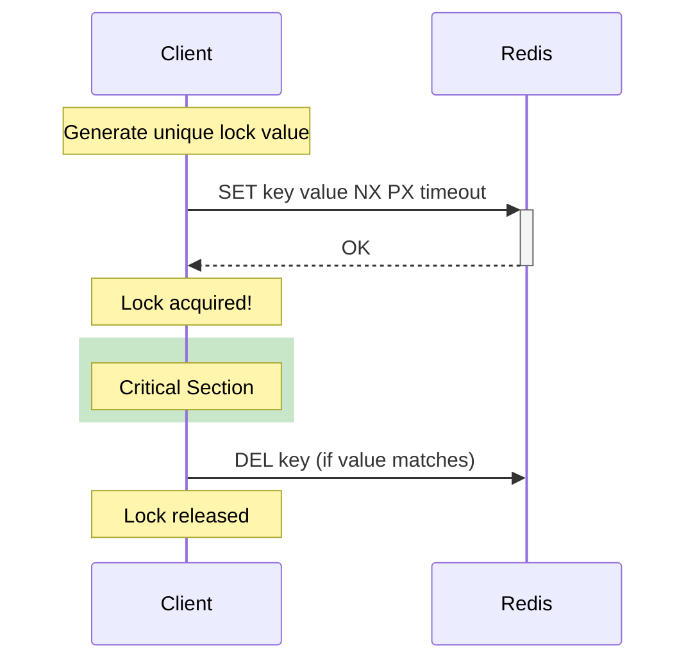
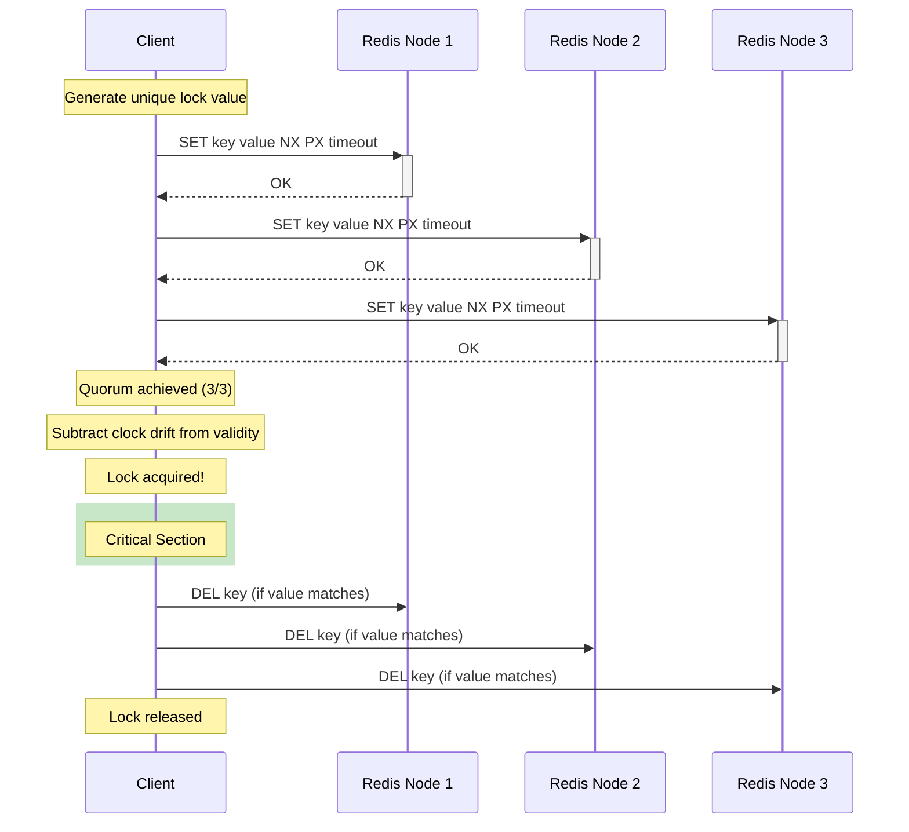

# Redlock - Standard Distributed Lock

The standard Redlock implementation provides mutual exclusion across distributed systems using the Redlock algorithm.

## Overview

| Property | Value |
|----------|-------|
| **Type** | Exclusive Lock |
| **Reentrancy** | Supported (per-thread) |
| **Interface** | `java.util.concurrent.locks.Lock` |
| **Consensus** | Quorum-based (N/2+1) |

## How It Works

### Single Node Mode



### Multi-Node Mode (Quorum)



## Key Concepts

### Quorum-Based Safety
Lock is only acquired when a majority of nodes (N/2+1) successfully accept the lock. This ensures safety even if some nodes fail.

### Clock Drift Compensation
Validity time accounts for clock drift between nodes:
```
validityTime = lockTimeout - acquisitionTime - (lockTimeout × driftFactor) - 2ms
```

### Compare-And-Delete (CAD)
Unlock uses atomic compare-and-delete to ensure only the lock owner can release:
```lua
if redis.call("GET", KEYS[1]) == ARGV[1] then
    return redis.call("DEL", KEYS[1])
end
return 0
```

## Usage

```java
Lock lock = redlockManager.createLock("my-resource");

// Blocking acquire
lock.lock();
try {
    performCriticalWork();
} finally {
    lock.unlock();
}

// Try with timeout
if (lock.tryLock(5, TimeUnit.SECONDS)) {
    try {
        performCriticalWork();
    } finally {
        lock.unlock();
    }
}
```

## Reentrancy

The lock supports reentrant acquisition by the same thread:

```java
lock.lock();      // hold count = 1
lock.lock();      // hold count = 2  
lock.unlock();    // hold count = 1
lock.unlock();    // hold count = 0, released
```

## Supported Modes

| Mode | Supported | Notes |
|------|-----------|-------|
| **Single Node** | ✅ | Optimized path, no quorum overhead |
| **Multi-Node (Quorum)** | ✅ | Full Redlock algorithm with N/2+1 consensus |

Mode is auto-selected based on configuration:
- 1 Redis node → Single Node mode
- 3+ Redis nodes → Multi-Node (Quorum) mode

## Configuration

| Parameter | Default | Description |
|-----------|---------|-------------|
| `lockTimeoutMs` | 30000 | Lock TTL in Redis |
| `acquisitionTimeoutMs` | 10000 | Max time to wait for lock |
| `retryDelayMs` | 100 | Delay between retry attempts |
| `clockDriftFactor` | 0.01 | Factor for clock drift compensation (multi-node only) |

## When to Use

**Good for:**
- Protecting critical sections
- Preventing duplicate job execution  
- Rate limiting distributed operations

**Consider alternatives for:**
- Read-heavy workloads → [ReadWriteLock](read-write-lock.md)
- Multiple resources → [MultiLock](multi-lock.md)
- Fair ordering → [FairLock](fair-lock.md)

## See Also

- [FairLock](fair-lock.md) - FIFO ordering guarantee
- [MultiLock](multi-lock.md) - Atomic multi-resource locking
- [ReadWriteLock](read-write-lock.md) - Reader/writer pattern
