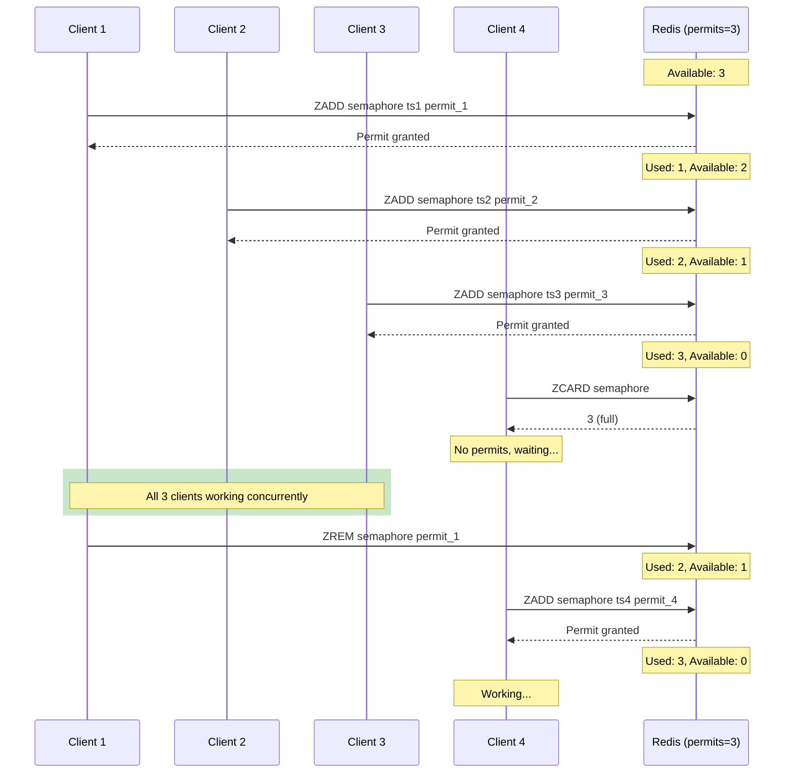

# Semaphore - Distributed Permit-Based Concurrency

Semaphore limits concurrent access to a shared resource with a configurable number of permits.

## Overview

| Property | Value |
|----------|-------|
| **Type** | Counting Semaphore |
| **Permits** | Configurable (1 to N) |
| **Fairness** | Non-fair (first-come basis) |
| **Expiration** | Auto-release on timeout |

## How It Works



## Key Concepts

### Sorted Set for Permits
Each permit is a member with timestamp score:
```
ZADD "semaphore:api-limiter" 1234567890.123 "permit-uuid"
```
Enables efficient count and expiration cleanup.

### Permit Count Check
```lua
local count = redis.call("ZCARD", semaphore_key)
if count < max_permits then
    redis.call("ZADD", semaphore_key, timestamp, permit_id)
    return 1  -- acquired
end
return 0  -- no permits available
```

### Automatic Expiration Cleanup
Stale permits are removed before count check:
```
ZREMRANGEBYSCORE semaphore 0 (current_time - timeout)
```

!!! note "Mode Differences"
    The diagram above shows the conceptual flow. In **multi-node mode**:

    - Permit set (ZADD) is replicated to all nodes
    - Permit acquisition requires quorum (N/2+1 nodes)
    - Available permit count is aggregated across nodes
    - Clock drift is applied to permit validity time

## Usage

```java
RedlockSemaphore semaphore = redlockManager.createSemaphore("api-limiter", 5);

// Try to acquire permit
if (semaphore.tryAcquire(Duration.ofSeconds(5))) {
    try {
        callRateLimitedAPI();
    } finally {
        semaphore.release();
    }
}

// Acquire multiple permits
if (semaphore.tryAcquire(3, Duration.ofSeconds(5))) {
    try {
        performBulkOperation();
    } finally {
        semaphore.release(3);
    }
}
```

## Use Cases

| Scenario | Permits | Purpose |
|----------|---------|---------|
| API rate limit | 10/sec | Prevent quota exhaustion |
| DB connection pool | 20 | Limit concurrent connections |
| File uploads | 5 | Control bandwidth usage |
| Batch jobs | 3 | Prevent resource starvation |

## Supported Modes

| Mode | Supported | Notes |
|------|-----------|-------|
| **Single Node** | ✅ | Permit set on single instance |
| **Multi-Node (Quorum)** | ✅ | Permits tracked per node, quorum required |

## Configuration

| Parameter | Default | Description |
|-----------|---------|-------------|
| `maxPermits` | (required) | Maximum concurrent permits |
| `permitTimeoutMs` | 30000 | Auto-release timeout |
| `acquisitionTimeoutMs` | 10000 | Max wait time for permit |

## Methods

| Method | Description |
|--------|-------------|
| `acquire()` | Block until permit available |
| `tryAcquire(Duration)` | Try with timeout |
| `tryAcquire(int, Duration)` | Try for multiple permits |
| `release()` | Release one permit |
| `release(int)` | Release multiple permits |
| `availablePermits()` | Current available count |

## When to Use

**Good for:**
- Rate limiting API calls
- Connection pooling
- Resource throttling
- Parallel task limiting

**Consider alternatives for:**
- Single exclusive access → [Redlock](redlock.md)
- Read-heavy workloads → [ReadWriteLock](read-write-lock.md)

## See Also

- [Redlock](redlock.md) - Exclusive locking (permits=1)
- [CountDownLatch](count-down-latch.md) - Coordination primitive
